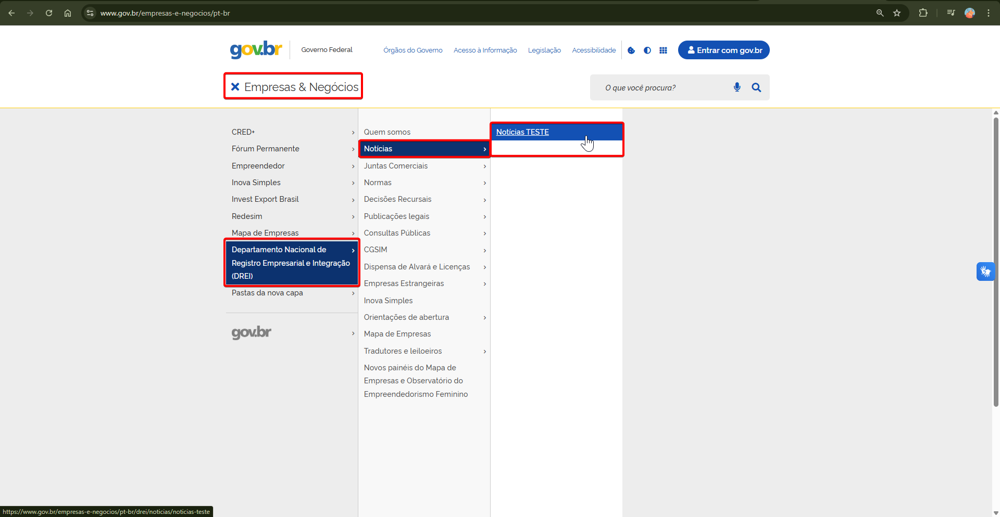
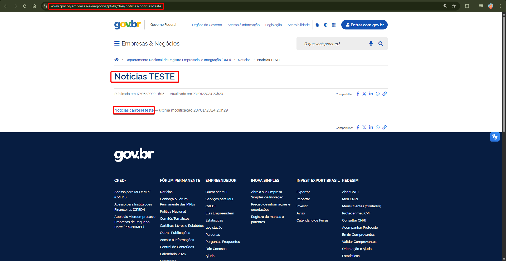
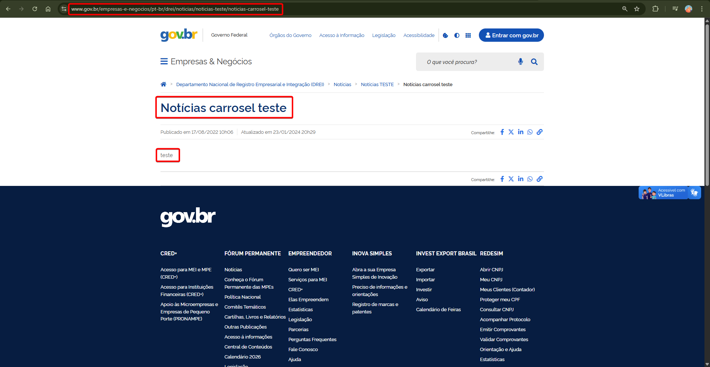

# Bug Report: Conteúdo de Teste Publicado em Ambiente de Produção

**Site:** Portal Gov.br — DREI (Departamento Nacional de Registro Empresarial e Integração)
**URL afetada:** https://www.gov.br/empresas-e-negocios/pt-br/drei/noticias/noticias-teste/noticias-carrosel-teste
**Data de descoberta:** 08/05/2026
**Primeira publicação (metadata da página):** 17/08/2022
**Última atualização (metadata da página):** 23/01/2024
**Severidade:** Alta
**Tipo:** Dados de Teste em Produção / Gestão de Conteúdo (CMS)
**Ambiente:** Produção (público, acessível sem autenticação)

---

## Descrição
Conteúdo de teste foi publicado e permanece visível publicamente no portal oficial
do governo federal brasileiro. O problema afeta múltiplos níveis de navegação.

## Evidências — Fluxo Completo

### Nível 1 — Menu de navegação do DREI
- Caminho: DREI > Notícias
- Anomalia: Existe uma subseção chamada **"Notícias TESTE"** visível no menu lateral

### Nível 2 — Página intermediária
- URL: /drei/noticias/noticias-teste
- Anomalia: Título da seção exibe "Notícias Teste" como se fosse conteúdo legítimo
- Anomalia adicional: Onde deveria existir um carrossel de notícias, há apenas
  um link clicável com o texto "notícias carrosel teste"

### Nível 3 — Página final (conteúdo da notícia)
- URL: /drei/noticias/noticias-teste/noticias-carrosel-teste
- Título da página: "Notícias carrosel teste"
- Corpo do conteúdo: apenas a palavra **"teste"**
- Compartilhamento social ativo (botões de Facebook, Twitter, LinkedIn, WhatsApp
  funcionais apontando para esta página de teste)

## Passos para Reproduzir
1. Acessar https://www.gov.br/empresas-e-negocios/pt-br/drei/noticias
2. Localizar "Notícias TESTE" no menu lateral
3. Clicar em "Notícias TESTE"
4. Observar o link "noticias carrosel teste" onde deveria haver um carrossel
5. Clicar no link
6. Verificar que o conteúdo publicado é apenas o texto "teste"

## Comportamento Esperado
Nenhum conteúdo de teste deve estar acessível publicamente em ambiente de produção.

## Impacto
- **Credibilidade institucional:** Conteúdo de teste visível no portal oficial do
  governo federal compromete a imagem do órgão público perante cidadãos.
- **SEO indevido:** A página está indexada e possui metadados Open Graph ativos,
  podendo aparecer em resultados de busca e compartilhamentos em redes sociais.
- **Processo de publicação falho:** Indica ausência de checklist de validação
  antes da publicação no CMS (Plone), e falta de ambiente de homologação separado.
- **Tempo de exposição:** Conteúdo publicado desde 17/08/2022 — mais de 3 anos
  em produção sem remoção.

## Causa Provável
Falha no processo de gestão de conteúdo (CMS Plone):
- Ausência de fluxo de aprovação/revisão antes da publicação
- Inexistência de ambiente de staging/homologação separado do produção
- Falta de varredura periódica por conteúdo de teste publicado indevidamente

## Classificação (ISO/IEC 25010)
- Característica: **Manutenibilidade**
- Subcaracterística: **Modificabilidade / Gestão de Conteúdo**
- Impacto secundário: **Confiabilidade** e **Adequação Funcional**