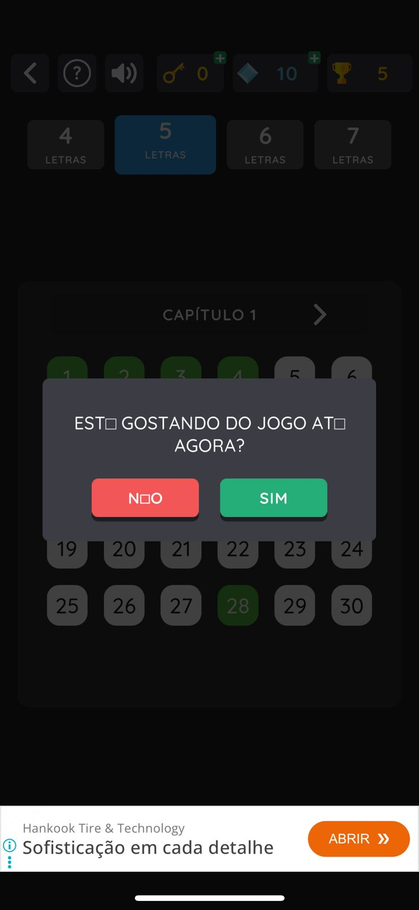
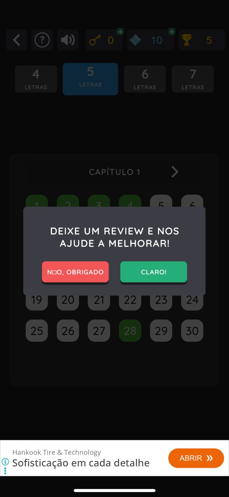

# Bug Report: Encoding UTF-8 — Caracteres especiais substituídos por □

**App:** Termo (iOS)  
**Versão:**  
**SO:** iOS 
**Data:** 08/05/2026  
**Severidade:** Média  
**Tipo:** UI / Internacionalização (i18n)

## Descrição
Caracteres com acentuação (Ã, É, Ã, etc.) são exibidos como
o caractere de substituição Unicode (□) em modais/pop-ups do app.

## Passos para Reproduzir
1. Abrir o app Termo no iOS
2. Avançar até o nível 5 letras, Capítulo 1
3. Aguardar o pop-up de avaliação aparecer

## Comportamento Esperado
"ESTÁ GOSTANDO DO JOGO ATÉ AGORA?"
"NÃO"

## Comportamento Atual
"EST□ GOSTANDO DO JOGO AT□ AGORA?"
"N□O"

## Evidências

## Causa Provável
String hardcoded ou arquivo de localização (.strings) salvo
fora do encoding UTF-8, ou concatenação incorreta de NSString
sem respeitar encoding dos caracteres especiais do português.

## Impacto
Afeta usuários de língua portuguesa — mercado principal do app.